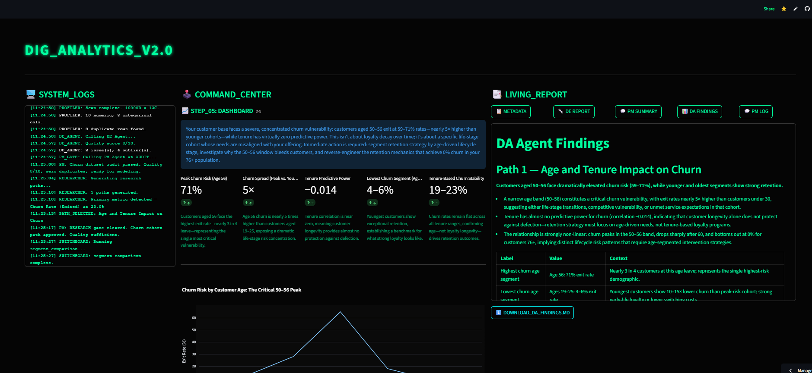

# DIG Wizard


# DIG Wizard — AI intagrted Data Analysis Platform 

> Upload a CSV and Six AI agents will lead you through audit quality, plan research paths, run 
> Analysis tools, and deliver an executive dashboard — no SQL, no code, 
> no configuration.

🔗 **[Live Demo](https://dig-wizard-6nxd33o7va4tvdygxvbsag.streamlit.app/)** · 
📁 Sample dataset included: `Bank_Churn.csv` from kaggele datasets



---

**DIG** (Description → Introspection → Goal Setting) is a multi-agent AI platform that turns any CSV into an executive-grade data analysis — no SQL, no code, no dashboards to configure. Upload a file, and six specialized LLM agents audit quality, plan research paths, run statistical tools, and deliver a structured report with visualizations and recommendations.

---

## Pipeline

```
START → AUDIT → RESEARCH → ANALYSIS → DASHBOARD
```

| Stage | What happens |
|-------|-------------|
| **START** | User uploads CSV; pandas profiler extracts schema, stats, nulls |
| **AUDIT** | DE Agent scores data quality (1–10), flags issues and outliers |
| **RESEARCH** | Researcher Agent proposes 5 analysis paths, each with 2–5 tool steps |
| **ANALYSIS** | DA Agent runs tools via the Switchboard, interprets each result |
| **DASHBOARD** | BI Agent builds KPIs + Plotly charts; Synthesis Agent writes the narrative |

The PM Agent acts as an orchestrator throughout — it gates each stage transition and generates user-facing progress summaries.

---

## Agents

| Agent | File | Role |
|-------|------|------|
| Data Engineer | `agents/de_agent.py` | Data quality audit — score, issues, outliers |
| Product Manager | `agents/pm_agent.py` | Stage gating + progress summaries |
| Researcher | `agents/researcher_agent.py` | 5 research paths × 2–5 tool instructions each |
| Data Analyst | `agents/da_agent.py` | Interprets tool results into business insights |
| BI Developer | `agents/bi_agent.py` | KPI cards + Plotly chart configs |
| Synthesis | `agents/synthesis_agent.py` | Executive narrative + 3–5 recommendations |

---

## Design Principles

- **Pandas counts, LLM thinks** — all arithmetic stays in `core/profiler.py` and `core/starter_kit.py`; agents only interpret
- **Parametric over agentic** — Python controls flow; the LLM triggers named functions by name, never writes code
- **LLM never sees raw data** — agents receive only `json.dumps(profiler_output)`
- **Pydantic everywhere** — every LLM JSON response is validated before touching `session_state`

---

## Tech Stack

| Layer | Technology |
|-------|-----------|
| UI | [Streamlit](https://streamlit.io) (cyberpunk theme, 3-column layout) |
| LLM | [Anthropic Claude](https://anthropic.com) (`claude-haiku-4-5-20251001`) |
| Data | pandas, numpy, scipy |
| Charts | Plotly |
| Validation | Pydantic v2 |
| Package manager | [uv](https://github.com/astral-sh/uv) |

---

## Project Structure

```
DIG Wizard/
├── app.py                      # Streamlit entry point
├── pyproject.toml
├── agents/
│   ├── de_agent.py
│   ├── pm_agent.py
│   ├── researcher_agent.py
│   ├── da_agent.py
│   ├── bi_agent.py
│   └── synthesis_agent.py
├── core/
│   ├── profiler.py             # Pandas profiler — extracts metadata from CSV
│   ├── starter_kit.py          # 10 analysis functions + TOOL_MAP registry
│   └── switchboard.py          # Validates & dispatches tool instructions
├── utils/
│   └── utils.py                # Retry backoff + cost tracking
└── docs/
    ├── DIG ANALYTICS CLAUDE.md # 15-stage build plan
    └── session_state_registry.md
```

---

## Setup

**Requirements:** Python 3.12+, [uv](https://github.com/astral-sh/uv), an Anthropic API key.

```bash
git clone https://github.com/idanlasry/DIG-Wizard.git
cd dig-wizard

# Copy env template and add your key
cp .env.example .env
# Edit .env and set: ANTHROPIC_API_KEY=sk-ant-...

# Install dependencies
uv sync

# Run
uv run streamlit run app.py
```

Then open [http://localhost:8501](http://localhost:8501), upload a CSV, and click through the pipeline.

> **Sample dataset:** `Bank_Churn.csv` is included at the repo root for testing.

---

## Build Status

| Stage | Status |
|-------|--------|
| 1–13: Full pipeline (profiler, 6 agents, multi-path loop, dashboard, synthesis) | ✅ Complete |
| 14: Deployment, README, portfolio | ✅ Complete |

---

## License

MIT
